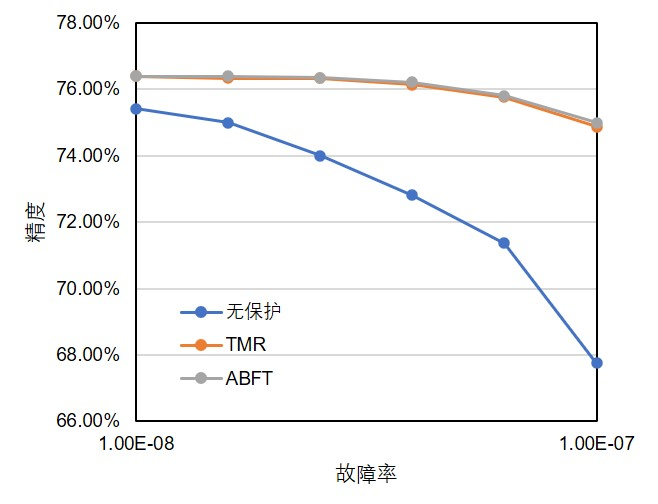
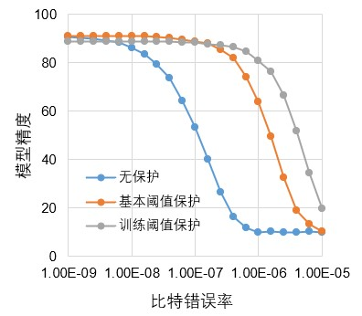

## Introduction
Neural networks that typically output discrete classification results rather than continuous values are 
not sensitive to computing variations caused by either hardware errors or quantization. Hence, it makes 
it possible to investigate the inherent fault tolerance of neural networks to protect against soft errors
in the underlying computing fabrics, which can be essentially incorporated in model paramters through 
training or fine-tuning.

In this project, we mainly investigate two different approaches to enhance the fault tolerance capability
of neural networks with training. 

First, we observe that soft errors that are typically abstracted as bit-flip 
errors pose more negative influence to the overall model accuracy when the values of weights and activations are larger. This is somehow as expected because bit-flip errors can induce larger computing variations when the data value is larger. With this observation, we seek to depress the data range in neural network processing during quantization as long as the accuracy meets the design constraints. Particularly, we may further shrink the quantization region such that more data can be quantized with lower bound while retaining the model accuracy. This approach is implemented along with the model quantization and does not need to change the model architecture.

Second, instead of restricting the data range of neural network processing, we try to fix the computing errors. Basically, the model accuracy drop is mostly attributed to large faulty data values, so we add an additional output filters to ignore exceptional outputs. The threshold that determines whether a data is exceptional can be simply obtained with profiling or sampling. However, it may also filter out some correct data and leads to model accuracy loss, we incorporate the filter with Relu functions widely used in neural networks and learn the threshold along during training such that both fault tolerance and model accuracy can be guaranteed.

The fault-tolerant approaches are implemented on GPU and compared to other typical fault tolerant approaches including TMR and algorithm based fault tolerant approach. The initial results are also compared as follows.

## Usage
To be added soon.

## License

Copyright Released under the [MIT License](https://opensource.org/licenses/MIT).
